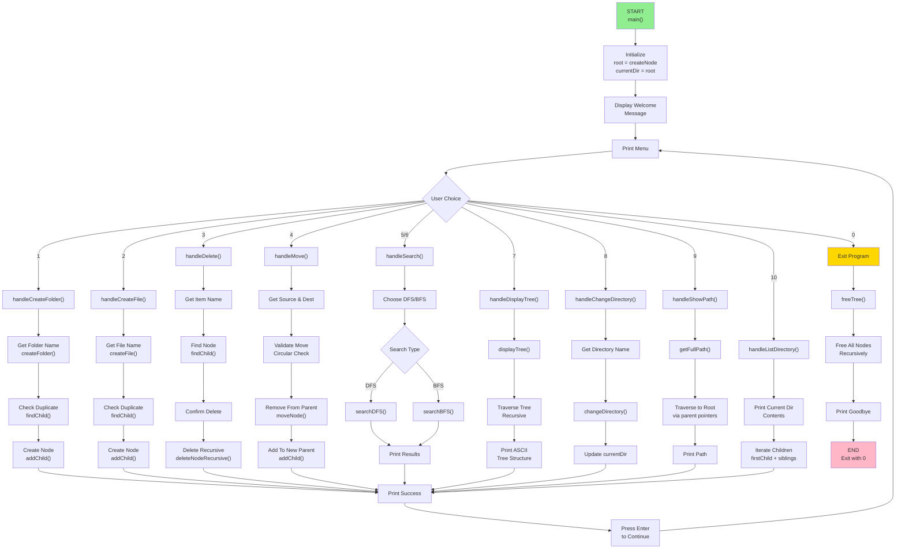

# 🗂️ File Explorer using Tree - Data Structure Mini Project

<div align="center">


A sophisticated **menu-driven file system simulator** implemented in C using **Tree Data Structure** with interactive operations for managing hierarchical files and folders.

[Features](#-features) • [Installation](#-installation) • [Usage](#-usage-guide) • [Architecture](#-architecture) • [Examples](#-examples)

</div>

---

## 📌 Overview

This project demonstrates the implementation of a **hierarchical file system** using a **tree data structure** with parent-child-sibling relationships. It provides a complete simulation of file management operations commonly found in real operating systems.

### ✨ Highlights
- 🎯 **Complete File System Simulation** with folder and file management
- 🔍 **Dual Search Algorithms** - DFS and BFS implementations
- 🌳 **ASCII Tree Visualization** with beautiful formatting
- 🛡️ **Robust Error Handling** and input validation
- 💾 **Dynamic Memory Management** with proper cleanup
- ⚡ **Efficient Operations** with optimal time complexity

---

## 🎯 Features

| Feature | Description | Complexity |
|:--------|:------------|:-----------|
| 📁 **Create Folder** | Create new folders with duplicate prevention | O(n) |
| 📄 **Create File** | Create new files in folders | O(n) |
| 🗑️ **Delete** | Recursively delete files/folders with confirmation | O(m) |
| 🚚 **Move** | Move files/folders with circular reference prevention | O(n+m) |
| 🔍 **DFS Search** | Depth-first search with substring matching | O(n) |
| 📊 **BFS Search** | Breadth-first search with queue implementation | O(n) |
| 🌳 **Display Tree** | ASCII tree visualization with icons | O(n) |
| 📂 **Navigate** | Change directories with `.` and `..` support | O(k) |
| 📍 **Path Display** | Show absolute path from root | O(h) |
| 📋 **List Contents** | Display current directory contents sorted | O(n) |

### Advanced Features
✅ Memory leak prevention with proper malloc/free  
✅ Sorted display (folders first, alphabetically)  
✅ Comprehensive error messages  
✅ Input validation for all operations  
✅ Prevention of cyclic references  
✅ Current directory tracking with [Current] marker  

---

## 🏗️ Architecture

### Data Structure

The system uses a **Tree with three-pointer representation**:

```c
typedef struct Node {
    char name[50];            // File/Folder name
    int isFile;               // 1=file, 0=folder
    struct Node *parent;      // Parent reference
    struct Node *firstChild;  // First child pointer
    struct Node *nextSibling; // Next sibling pointer
} Node;
```

### Structural Example

```
          📁 root
         /   |   \
    📁 docs  📁 bin  📁 home
     / |      |      |
   📄 readme  📄 ls   📄 data.txt
```

This three-pointer approach provides:
- ✅ Efficient upward navigation (parent pointer)
- ✅ Easy downward traversal (firstChild pointer)
- ✅ Sibling linking for horizontal movement
- ✅ Minimal memory overhead (only 3 pointers per node)

---

## 📊 Program Flow Diagram

### Main Program Execution Flow



### Function Call Hierarchy

```
main()
├── createNode()           ← Create new nodes
├── addChild()             ← Add to tree
├── findChild()            ← Search in children
├── createFolder()         ← Create folder operation
│   ├── findChild()
│   ├── createNode()
│   └── addChild()
├── createFile()           ← Create file operation
│   ├── findChild()
│   ├── createNode()
│   └── addChild()
├── deleteNode()           ← Delete operation
│   ├── removeFromParent()
│   └── deleteNodeRecursive()
├── moveNode()             ← Move operation
│   ├── removeFromParent()
│   └── addChild()
├── searchDFS()            ← Depth-first search
│   └── getFullPath()
├── searchBFS()            ← Breadth-first search
│   └── getFullPath()
├── displayTree()          ← Display tree structure
│   └── recursive calls
├── changeDirectory()      ← Navigate directories
│   └── findChild()
├── getFullPath()          ← Build absolute path
├── printCurrentPath()     ← Print path
├── handleCreateFolder()   ← Menu handlers
├── handleCreateFile()
├── handleDelete()
├── handleMove()
├── handleSearch()
├── handleDisplayTree()
├── handleChangeDirectory()
├── handleShowPath()
├── handleListDirectory()
└── freeTree()             ← Cleanup memory
```

---

## 🚀 Quick Start

### Prerequisites
```bash
# Required
- GCC Compiler (or any C11 compiler)
- Terminal/Command Line
- ~35KB disk space
```

### Installation & Compilation

```bash
# Clone the repository
git clone https://github.com/yourusername/File-Explorer-Tree.git
cd File-Explorer-Tree

# Compile the program
gcc -o file_explorer file_explorer.c -Wall -Wextra

# Run the program
./file_explorer
```

### Compilation Flags Explanation
- `-Wall` : Enable all standard warnings
- `-Wextra` : Enable extra warnings
- `-O2` : Optimization level (optional)
- `-g` : Debug symbols (optional)

---

## 📖 Usage Guide

### Welcome Screen

```
╔════════════════════════════════════════╗
║                                        ║
║    FILE EXPLORER SYSTEM IN C           ║
║    Using Tree Data Structure           ║
║                                        ║
╚════════════════════════════════════════╝
```

### Main Menu

```
========================================
       FILE EXPLORER SYSTEM
========================================
Current Directory: /root
========================================
1.  Create Folder
2.  Create File
3.  Delete
4.  Move
5.  Search (DFS)
6.  Search (BFS)
7.  Display Tree
8.  Change Directory
9.  Show Current Path
10. List Current Directory
0.  Exit
========================================
```

### Command Reference

| Command | Purpose | Example |
|:--------|:--------|:--------|
| `1` | Create Folder | Creates `Documents` folder |
| `2` | Create File | Creates `readme.txt` file |
| `3` | Delete | Deletes file/folder recursively |
| `4` | Move | Moves file between folders |
| `5` | Search DFS | Finds all files containing search term |
| `6` | Search BFS | Level-by-level search |
| `7` | Display Tree | Shows full directory structure |
| `8` | Change Dir | Navigate to parent/child/root |
| `9` | Show Path | Display current absolute path |
| `10` | List Dir | Show current directory contents |
| `0` | Exit | Gracefully exit with cleanup |

---

## 💡 Examples

### Example 1: Basic Workflow

```bash
$ ./file_explorer

Enter your choice: 1
📁 CREATE FOLDER
Enter folder name: Documents
✅ Folder 'Documents' created successfully!

Enter your choice: 1
📁 CREATE FOLDER
Enter folder name: Pictures
✅ Folder 'Pictures' created successfully!

Enter your choice: 2
📄 CREATE FILE
Enter file name: readme.txt
✅ File 'readme.txt' created successfully!

Enter your choice: 7
🌳 DIRECTORY TREE
========================================
📁 root [Current]
├── 📁 Documents
├── 📁 Pictures
└── 📄 readme.txt
========================================
```

### Example 2: Navigation

```bash
Enter your choice: 8
📂 CHANGE DIRECTORY
Enter directory name: Documents
✅ Changed to directory: /root/Documents

Enter your choice: 2
📄 CREATE FILE
Enter file name: notes.txt
✅ File 'notes.txt' created successfully!

Enter your choice: 9
📍 CURRENT PATH
Full path: /root/Documents

Enter your choice: 8
Enter directory name: ..
✅ Changed to parent directory: /root
```

### Example 3: Search Operations

```bash
Enter your choice: 5
🔍 SEARCH
1. DFS (Depth-First Search)
2. BFS (Breadth-First Search)
Choose search type: 1
Enter search term: doc

🔍 Searching for 'doc'...
Using DFS:
  📁 /root/Documents
  📄 /root/Documents/notes.doc
  📄 /root/Documents/backup/old.doc
```

### Example 4: Move and Delete

```bash
Enter your choice: 4
🚚 MOVE
Enter name of file/folder to move: readme.txt
Enter destination folder name: Documents
✅ 'readme.txt' moved successfully!

Enter your choice: 3
🗑️  DELETE
Enter name of file/folder to delete: Pictures
⚠️  This will delete the folder and all its contents. Continue? (y/n): y
✅ Folder 'Pictures' and all its contents deleted successfully!
```

---

## 🧪 Test Scenarios

### Test Case 1: Nested Structure Creation

```
Steps:
1. Create folder "src"
2. Navigate to src
3. Create folder "components"
4. Navigate to components
5. Create files "button.c", "input.c"
6. Navigate to root
7. Display tree

Expected Result:
📁 root [Current]
└── 📁 src
    └── 📁 components
        ├── 📄 button.c
        └── 📄 input.c
```

### Test Case 2: Search Functionality

**Setup:**
```
root/
├── Documents/
│   └── report.txt
├── Projects/
│   ├── project1.c
│   └── project2.c
└── data.txt
```

**Test:** Search for "project"
```
Using DFS:
  📁 /root/Projects
  📄 /root/Projects/project1.c
  📄 /root/Projects/project2.c
```

### Test Case 3: Error Handling

| Scenario | Expected Result |
|:---------|:----------------|
| Create duplicate folder | ❌ Error: Already exists |
| Delete current directory | ❌ Error: Cannot delete current |
| Move folder into itself | ❌ Error: Circular reference |
| Create file in a file | ❌ Error: Invalid parent |
| Navigate to non-existent folder | ❌ Error: Not found |

### Test Case 4: Stress Test

```
Create 100 files across multiple folders
→ No memory leaks
→ All operations respond quickly
→ Tree displays correctly
→ Clean exit with proper cleanup
```

---

## 🔧 Algorithm Analysis

### Time & Space Complexity

```
┌─────────────────────┬──────────────┬──────────────┐
│ Operation           │ Time         │ Space        │
├─────────────────────┼──────────────┼──────────────┤
│ Create              │ O(n)         │ O(1)         │
│ Delete              │ O(m)         │ O(1)         │
│ Move                │ O(n + m)     │ O(1)         │
│ Search (DFS)        │ O(n)         │ O(h)         │
│ Search (BFS)        │ O(n)         │ O(w)         │
│ Display Tree        │ O(n)         │ O(h)         │
│ Get Path            │ O(h)         │ O(h)         │
│ Navigate            │ O(k)         │ O(1)         │
└─────────────────────┴──────────────┴──────────────┘

Where:
n = number of siblings to check
m = nodes in subtree
h = height of tree
w = maximum width of tree
k = children count
```

### Algorithm Implementations

#### 1. Depth-First Search (Recursive)
```c
void searchDFS(Node *node, const char *name, const char *currentPath) {
    if (node == NULL) return;
    
    // Check current node
    if (strstr(node->name, name) != NULL) {
        printf("  %s\n", fullPath);
    }
    
    // Recurse through children
    if (!node->isFile) {
        Node *child = node->firstChild;
        while (child != NULL) {
            searchDFS(child, name, newPath);
            child = child->nextSibling;
        }
    }
}
```
**Characteristics:**
- Pre-order traversal
- Stack-based (function call stack)
- Finds deep paths first
- O(n) time, O(h) space

#### 2. Breadth-First Search (Iterative)
```c
void searchBFS(Node *root, const char *name) {
    Node *queue[1000];
    int front = 0, rear = 0;
    
    queue[rear++] = root;
    
    while (front < rear) {
        Node *current = queue[front++];
        
        // Process current
        if (match found) {
            printf("  %s\n", path);
        }
        
        // Enqueue children
        for (each child) {
            queue[rear++] = child;
        }
    }
}
```
**Characteristics:**
- Level-order traversal
- Queue-based implementation
- Finds wider paths first
- O(n) time, O(w) space

---

## 📊 File Organization

```
File-Explorer-Tree/
├── 📄 file_explorer.c        # Main implementation (29KB)
├── 📄 README.md              # This file
├── 📄 README_C.md            # Detailed documentation
├── 📄 TEST_SCENARIOS.md      # Test cases and examples
└── 📄 LICENSE                # MIT License
```

### Code Structure

```c
file_explorer.c
│
├── INCLUDES & CONSTANTS
│   └── stdio.h, stdlib.h, string.h, stdbool.h
│
├── STRUCTURE DEFINITIONS
│   └── Node struct (3-pointer tree)
│
├── GLOBAL VARIABLES
│   ├── Node *root
│   └── Node *currentDir
│
├── CORE FUNCTIONS
│   ├── Node Management
│   │   ├── createNode()
│   │   ├── addChild()
│   │   └── findChild()
│   │
│   ├── File Operations
│   │   ├── createFolder()
│   │   ├── createFile()
│   │   ├── deleteNode()
│   │   └── moveNode()
│   │
│   ├── Search Operations
│   │   ├── searchDFS()
│   │   └── searchBFS()
│   │
│   ├── Display Operations
│   │   ├── displayTree()
│   │   ├── getFullPath()
│   │   └── printCurrentPath()
│   │
│   └── Navigation
│       └── changeDirectory()
│
├── MENU FUNCTIONS
│   ├── printMenu()
│   ├── handleCreateFolder()
│   ├── handleCreateFile()
│   ├── handleDelete()
│   ├── handleMove()
│   ├── handleSearch()
│   ├── handleDisplayTree()
│   ├── handleChangeDirectory()
│   ├── handleShowPath()
│   └── handleListDirectory()
│
└── MAIN FUNCTION
    └── main() - Menu loop and program flow
```

---

## 🎓 Learning Concepts

This project covers essential data structures and algorithms:

### Data Structures
- ✅ **Tree (N-ary)** - Hierarchical parent-child relationships
- ✅ **Linked List** - Sibling traversal using next pointers
- ✅ **Queue** - For BFS implementation

### Algorithms
- ✅ **Depth-First Search (DFS)** - Recursive tree traversal
- ✅ **Breadth-First Search (BFS)** - Level-order traversal
- ✅ **Tree Traversal** - Multiple patterns (pre-order, level-order)
- ✅ **Recursive Algorithms** - Tree display, deletion

### Programming Concepts
- ✅ **Dynamic Memory Management** - malloc/free patterns
- ✅ **Pointer Manipulation** - Complex pointer relationships
- ✅ **String Operations** - Path building and searching
- ✅ **Menu-Driven Programming** - User interface design
- ✅ **Error Handling** - Input validation and edge cases
- ✅ **Modular Design** - Separated concerns with helper functions

---

## 🔐 Error Handling

The system robustly handles error conditions:

```
✓ Duplicate File/Folder Names
  → Prevents creation with existing name
  
✓ Invalid Parent Validation
  → Cannot create items inside files
  
✓ Protected Operations
  → Cannot delete root
  → Cannot delete current directory
  → Cannot delete directory ancestors
  
✓ Circular Reference Prevention
  → Cannot move folder into itself
  → Cannot move into descendants
  
✓ Input Validation
  → Validates all scanf inputs
  → Clears input buffer after errors
  
✓ Memory Safety
  → Proper malloc/free pairs
  → Null pointer checks
  → No buffer overflows
```

---

## 🚀 Future Enhancements

Potential features for future versions:

### 1. Undo/Redo Functionality
```c
typedef struct {
    enum { CREATE, DELETE, MOVE } type;
    Node *node;
    Node *oldParent;
} Operation;

Operation undoStack[100];
```

### 2. File Metadata
```c
typedef struct {
    long size;
    time_t createdAt;
    time_t modifiedAt;
    int permissions;
} Metadata;
```

### 3. Persistence
```c
void saveTree(Node *root, const char *filename);
Node* loadTree(const char *filename);
```

### 4. File Content
```c
typedef struct {
    char content[1000];
    int contentSize;
} FileData;
```

### 5. Symlinks/Shortcuts
```c
struct Node {
    // ... existing fields ...
    Node *link;  // For shortcuts
};
```

---

## 📋 Quick Reference

### Navigation Shortcuts
```
/     → Jump to root
..    → Go to parent
name  → Go to child folder
```

### Common Operations Sequence
```
1. Create Folder "Documents"
2. Navigate to Documents (cd Documents)
3. Create File "note.txt"
4. Go back (cd ..)
5. Display tree (7)
6. Search (5 or 6)
7. Move file (4)
8. Delete (3)
9. Exit (0)
```

### Icon Guide
```
📁  Folder (directory)
📄  File
📂  Current directory
🗑️  Delete operation
🚚  Move operation
🔍  Search operation
🌳  Tree display
✅  Success message
❌  Error message
⚠️  Warning/Confirmation
```

---

## 🔗 Related Resources

### Tree Data Structure
- [GeeksforGeeks - Trees](https://www.geeksforgeeks.org/binary-tree-data-structure/)
- [Tree Traversals (DFS and BFS)](https://www.geeksforgeeks.org/tree-traversals-inorder-preorder-and-postorder/)

### C Programming
- [Dynamic Memory Allocation in C](https://www.geeksforgeeks.org/malloc-vs-calloc-in-c/)
- [Pointers in C](https://www.geeksforgeeks.org/pointers-in-c-and-c-plus-plus/)

### File System Design
- [File System Architecture](https://en.wikipedia.org/wiki/File_system)
- [Inode Structure](https://en.wikipedia.org/wiki/Inode)

---

## 📝 License

This project is licensed under the **MIT License** - see the LICENSE file for details.

```
MIT License

Permission is hereby granted, free of charge, to any person obtaining a copy
of this software and associated documentation files (the "Software"), to deal
in the Software without restriction, including without limitation the rights
to use, copy, modify, merge, publish, distribute, sublicense, and/or sell
copies of the Software.
```

---

## 👨‍💻 Author

**Pranav Rao**  
*REVA University - 3rd Semester*  
*Data Structures Project - October 2025*

### Academic Institution
- **University**: REVA University
- **Course**: Data Structures (DS)
- **Project Type**: Mini Project
- **Semester**: 3rd

---

## 🙏 Acknowledgments

- **REVA University** - For the project opportunity
- **Data Structures Course** - For the theoretical foundation
- **C Programming Community** - For best practices and patterns

---

## 📞 Support

For questions, issues, or suggestions:

1. **Check** the [TEST_SCENARIOS.md](TEST_SCENARIOS.md) file
2. **Review** the [README_C.md](README_C.md) for detailed documentation
3. **Create** an issue on GitHub
4. **Reach out** via email

---

## 🎉 Version History

| Version | Date | Changes |
|:--------|:-----|:--------|
| 1.0 | Oct 2025 | Initial release |
| | | All features implemented |
| | | Comprehensive documentation |
| | | Complete test scenarios |

---

<div align="center">

### ⭐ If you found this helpful, please star the repository!

[⬆ Back to Top](#-file-explorer-using-tree---data-structure-mini-project)

**Made with ❤️ for learning and understanding Data Structures**

</div>
